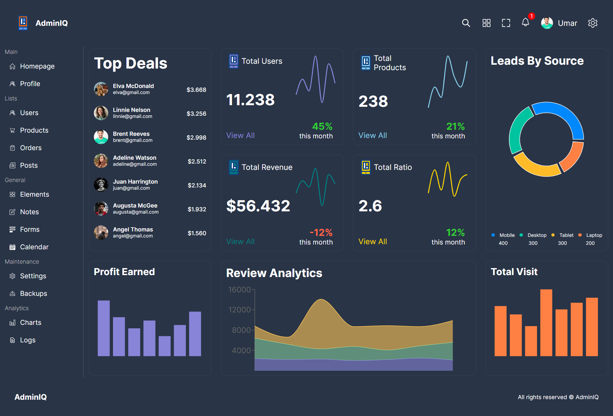

# React Admin Dashboard



## Overview

This is a powerful React Admin Dashboard built with TypeScript, Recharts, CSS, and React. It provides a comprehensive and visually appealing interface for managing and monitoring your data. The combination of modern technologies ensures a smooth and responsive user experience.

## Features

- **TypeScript**: The entire project is written in TypeScript, adding static typing to your codebase for improved developer productivity and code quality.

- **Recharts Integration**: Utilizing Recharts, a popular charting library for React, allows you to easily visualize and analyze data through interactive and customizable charts.

- **CSS Styling**: The styling is done using CSS to provide a clean and modern look to the dashboard. Customization options are available to adapt the appearance to your brand or design preferences.

- **React Components**: The dashboard is built with reusable and modular React components, making it easy to maintain and extend as your project grows.

## Getting Started

1. **Clone the Repository:**
   ```bash
    https://github.com/UMAR-78/React-Admin-Dashboard.git
   ```

2. **Install Dependencies:**
   ```bash
   cd React-Admin-Dashboard
   npm install
   ```

3. **Run the Application:**
   ```bash
   npm run dev
   ```

   This will start the development server, and you can view the dashboard by navigating to [http://localhost:3000](http://localhost:3000) in your browser.

## Customize

Feel free to customize the dashboard according to your requirements. The project structure is organized to facilitate easy customization:

- `src/components`: Contains reusable React components.
- `src/pages`: Includes different pages of the dashboard.

## Dependencies

- React
- TypeScript
- Recharts
- Other dependencies can be found in the `package.json` file.

## Contributing

If you find any issues or have suggestions for improvements, feel free to open an issue or submit a pull request. Your contributions are highly welcome!

## License

This project is licensed under the MIT License - see the [LICENSE](LICENSE) file for details.

---

Enjoy using your React Admin Dashboard! If you have any questions or need assistance, feel free to reach out to the project maintainers.
